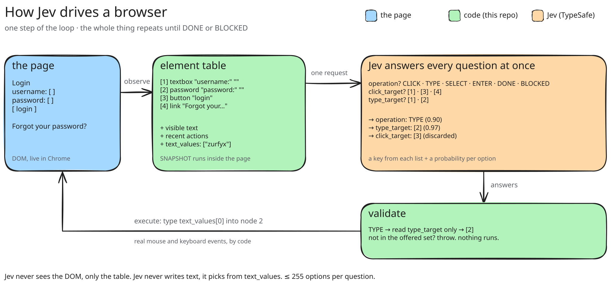

# Jev Browser Skill ⚡

> [!IMPORTANT]
> **This is a reference implementation, built to be read.** Three short files, six operations, no dependencies, and a step-by-step explainer site: [jev-browser.vercel.app](https://jev-browser.vercel.app). It works on ordinary pages and stops exactly where the interesting limits are. For the complete, production-grade version of the same idea, with a live inspector, region narrowing, stale-page guards and a text-generating helper model, see [browser-use/jev-ultrafast](https://github.com/browser-use/jev-ultrafast), which this skill follows. To wire Jev into your own project, point your coding agent at `scripts/core.mjs`, that repo, and this README.

**Let [Jev](https://typesafe.ai) drive your browser.** A plug-and-play skill for Claude Code and Codex: you name a site and a goal, Jev clicks, types and selects its way there, a few hundred milliseconds per decision.

<a href="docs/demo.mp4"></a>

*Hacker News at 1× speed, one goal: log in, search for "Jev", open the first result's comments. Eight decisions, eight seconds.* [Watch the MP4](docs/demo.mp4) · [Step through it](https://jev-browser.vercel.app)

## How Jev decides

Jev is TypeSafe's "System One" model. It does not generate text. One forward pass, no autoregression, and it answers a **multiple-choice question** with a key from a list you supplied, plus a calibrated probability for every option. This skill puts that in the hot path of a browser agent: the code builds the choices from the live page, Jev picks, the code executes the pick.



*Drag the SVG onto [excalidraw.com](https://excalidraw.com) to edit it; the scene is embedded.*

Here is the real third step of the video, on the Hacker News login page, after the username was typed. Everything below comes from the [recorded trace](site/traces/hackernews-login.json).

**1. Observe.** [`SNAPSHOT`](scripts/core.mjs) runs inside the page and returns a numbered table of the visible controls. Jev never sees the DOM, only this table and the page's visible text.

```json
{ "index": "1", "role": "textbox",  "label": "username:", "value": "zurfyx", "operation": "TYPE" },
{ "index": "2", "role": "password", "label": "password:", "value": "",       "operation": "TYPE" },
{ "index": "3", "role": "button",   "label": "login",                        "operation": "CLICK" },
{ "index": "4", "role": "link",     "label": "Forgot your password?",        "operation": "CLICK" }
```

**2. Ask.** [`buildRequest`](scripts/core.mjs) turns the goal, the table, the text values and the recent actions into one request with several named questions. Each question's `criteria` is the dictionary of allowed answers.

```jsonc
"questions": {
  "operation": {
    "type": "choice",
    "criteria": { "CLICK": "Click a link, button, …", "TYPE": "Type one of the provided text values …",
                  "ENTER": "Press Enter …", "DONE": "Every requirement …", "BLOCKED": "No offered operation …" },
    "instructions": { "goal": "Log in to Hacker News as user zurfyx. Then …", "rules": "…" }
  },
  "click_target": { "type": "choice", "criteria": { "3": { "element": "[3] button \"login\"" }, "4": { … }, … } },
  "type_target":  { "type": "choice", "criteria": { "1": { "element": "[1] textbox \"username:\"", "current_value": "zurfyx" },
                                                     "2": { "element": "[2] password \"password:\"", "current_value": "" }, … } }
}
```

Only operations that are possible right now are offered, and each target head lists only the elements that operation makes sense on. `ENTER` appears because the previous action was `TYPE`; `SELECT` is absent because the page has no dropdown.

**3. Jev answers every question at once.** A key from each dictionary, and the full distribution.

```json
"operation":    { "choice": "TYPE", "probabilities": { "TYPE": 0.91, "BLOCKED": 0.06, "CLICK": 0.02, "ENTER": 0.01, "DONE": 0 } },
"click_target": { "choice": "3",    "probabilities": { "3": 0.79, "5": 0.13, "1": 0.07, "4": 0.01 } },
"type_target":  { "choice": "2",    "probabilities": { "2": 1.00, "1": 0, "5": 0, "6": 0 } }
```

**4. Validate.** [`readDecision`](scripts/core.mjs) reads `operation`, sees `TYPE`, and looks only at `type_target`: element 2. The `click_target` answer is thrown away. That is the **speculative fan-out**: the operation and every possible target are answered in the same forward pass, so two dependent decisions cost one round trip. Any answer outside the offered set throws before anything runs.

**5. Execute.** [`browser.mjs`](scripts/browser.mjs) resolves index 2 back to the exact DOM node it observed, scrolls it into view, and types with real keyboard events. Then the loop observes again.

```text
 1  CLICK       link "login"                                p=0.60   355ms  +0.8s
 2  TYPE        textbox "username:" ← "zurfyx"             p=0.99   331ms  +1.7s
 3  TYPE        password "password:" ← "••••••"            p=0.90   163ms  +2.5s
 4  CLICK       button "login"                             p=0.89   155ms  +3.3s
 5  TYPE        textbox "q" ← "Jev"                        p=0.97   494ms  +4.6s
 6  ENTER                                                  p=0.92   288ms  +5.5s
 7  CLICK       link "500 comments"                        p=0.66   297ms  +6.6s
 8  DONE                                                   p=0.66   313ms  +8.2s
```

## What the limits teach

Each place this implementation stops is a lesson about Jev, and the [site](https://jev-browser.vercel.app) walks through all of them on the real trace.

- **Jev chooses, it never generates.** The strings to type arrive as `--text` values and go into the request as `text_values`; Jev picks which value belongs in the chosen field. A `--secret` is typed only into password fields and never enters a request: Jev sees that a password field exists and whether it is filled, never the value. The complete version adds a small LLM to write field text; this one does not.
- **At most 255 options per question.** So this skill offers the first 250 controls of a page and warns in the log when it skipped some. The Hacker News front page has 227. A product grid has more, and needs a first question that narrows to a region, which is what jev-ultrafast does.
- **The probabilities are calibrated, and that is the debugging tool.** While building the login demo Jev answered `BLOCKED 0.31` right after the password. The labels were the problem: the fields were named `acct` and `pw`, and the link and the button were both called `login`. Better labels in the table, and roles in the history, took it to `CLICK login 0.89`. `JEV_DEBUG=1` prints these distributions at every step.
- **Jev is stateless.** Every step is an independent request. The only memory it has is the `recent_actions` list the code chooses to send, which is why the history records the role and URL of each action and not just a label.
- **Cost.** A step is 3 to 6k input tokens; output is free. At Jev's list price that is a fraction of a cent per decision, and the whole eight-step demo costs less than a tenth of a cent. Each response reports its `usage`, and the trace keeps it.

Measured on a MacBook with a warm Jev window, wall clock from launch to `DONE`:

| Task | Steps | Total | Time in Jev |
| --- | --- | --- | --- |
| Wikipedia: search and open an article | 2 | 3.4s | 1.0s |
| Selenium web form: two fields, a dropdown, a checkbox, submit | 5 | 5.1s | 1.4s |
| Hacker News: log in, search for Jev, open the top thread's comments (the video) | 7 | 8.4s | 2.4s |

The rest is the page itself loading and rendering.

## Install

You need [Node 22+](https://nodejs.org), Chrome (or Edge, Brave, Chromium) and a [TypeSafe API key](https://console.typesafe.ai/keys). No `npm install`, no Playwright, no browser download.

**Claude Code**

```bash
git clone https://github.com/zurfyx/jev-browser-skill ~/.claude/skills/jev-browser
```

**Codex**

```bash
git clone https://github.com/zurfyx/jev-browser-skill ~/.codex/skills/jev-browser
```

**Then add your key**

```bash
export TYPESAFE_API_KEY=apikey_...
```

Or put that line (without `export`) in a `.env` file inside the skill folder.

## Use

Start a new session and ask:

> Use Jev to search Wikipedia for Alan Turing and open his article.

> With Jev, go to news.ycombinator.com and open the top story's comments.

> Use Jev to log in to example.com as ada and change the language to Catalan.

Each target lights up as Jev picks it, and your agent reports back with the step log, the timings and the final page.

## Which browser

By default the skill drives **your own browser** if it allows remote debugging, and otherwise opens a **Jev window**: a separate Chrome with its own profile that stays open and is reused by the next run, so logins persist and there is no start-up cost after the first time.

To let Jev use your own Chrome, with your tabs and your logins, do this once:

1. Open `chrome://inspect/#remote-debugging`.
2. Tick **Allow remote debugging for this browser instance**.

Chrome then shows an **Allow** popup once per run. Works with Chrome, Edge, Brave, Chromium and Arc on macOS, Windows and Linux.

## Run it without an agent

```bash
node ~/.claude/skills/jev-browser/scripts/jev.mjs \
  --url https://news.ycombinator.com \
  --goal "Log in as ada, search for 'Jev', open the first result's comments. Done when the thread is visible." \
  --text ada --text Jev --secret "$HN_PASSWORD" --trace run.json
```

| Flag | |
| --- | --- |
| `--url` | Where to start |
| `--goal` | The whole task in a sentence or two, including what "done" looks like |
| `--text` | A string Jev may type. Repeat for several values |
| `--secret` | A string typed only into password fields, never sent to Jev or printed |
| `--trace run.json` | Save every step: element table, request, answers, decision, screenshot. Drop it on the [site](https://jev-browser.vercel.app) to step through it |
| `--screenshot out.png` | Save the final page |
| `--browser` | `auto` (default), `yours`, `own`, or `host:port` |
| `--headless` | No window |
| `--close` | Close the tab or window at the end (it stays open by default so you can see the result) |
| `--max-steps` | Action budget, default 25 |

`CHROME_PATH` overrides browser detection, `JEV_PROFILE` moves the Jev window's profile (default `~/.jev-browser/chrome`), `TYPESAFE_MODEL` overrides the model (default `jev-latest`), and `JEV_DEBUG=1` prints Jev's probabilities and per-phase timings.

## Layout

```text
SKILL.md              what your agent reads
scripts/core.mjs      the part worth reading: observe, ask, validate. No Node APIs; the site runs this same file
scripts/browser.mjs   plumbing: a 150-line Chrome DevTools client, launch or attach
scripts/jev.mjs       the loop, the command line, the log, --trace
site/                 the explainer, jev-browser.vercel.app: replays traces, or runs the loop live with your key
docs/                 the video, the diagram (editable .excalidraw + embedded-scene .svg)
```

## Credits

The action-space design follows [browser-use/jev-ultrafast](https://github.com/browser-use/jev-ultrafast). Jev is built by [TypeSafe](https://typesafe.ai); their own [agent skill](https://docs.typesafe.ai/agent-skill) teaches an agent to call the API, this one teaches it to drive a browser with it. MIT licensed.
