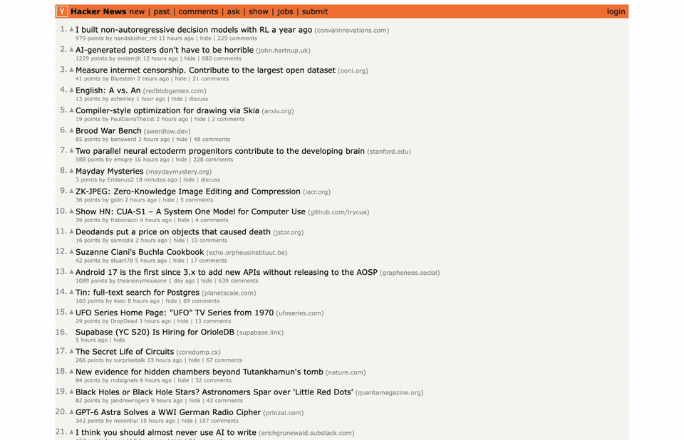

# Jev Browser Skill

> [!IMPORTANT]
> This skill is deliberately small: one script, six operations, no dependencies. Treat it as a **reference**. The complete version of this idea, with a live inspector, autocomplete handling, stale-page guards and a text-generating helper model, is [browser-use/jev-ultrafast](https://github.com/browser-use/jev-ultrafast), which this skill follows. To wire Jev into your own project, point your coding agent at `scripts/jev.mjs` and that repo and let it do the plumbing.

**Let [Jev](https://typesafe.ai) drive your browser.** A plug-and-play skill for Claude Code and Codex: you name a site and a goal, Jev clicks, types and selects its way there, a few hundred milliseconds per decision.

<a href="docs/demo.mp4"></a>

*Hacker News at 1× speed, one goal: log in, search for "Jev", open the first result's comments. Eight decisions, eight seconds.* [Watch the MP4](docs/demo.mp4)

Jev is TypeSafe's "System One" model: a single forward pass that returns a typed choice with a calibrated probability, instead of generating tokens. This skill puts it in the hot path of a browser agent. Your coding agent writes the goal once; **Jev makes every navigation decision**.

```text
 1  CLICK       link "login"                                p=0.60   355ms  +0.8s
 2  TYPE        textbox "username:" ← "zurfyx"             p=0.99   331ms  +1.7s
 3  TYPE        password "password:" ← "••••••"            p=0.90   163ms  +2.5s
 4  CLICK       button "login"                             p=0.89   155ms  +3.3s
 5  TYPE        textbox "q" ← "Jev"                        p=0.97   494ms  +4.6s
 6  ENTER                                                  p=0.92   288ms  +5.5s
 7  CLICK       link "500 comments"                        p=0.66   297ms  +6.6s
 8  DONE                                                   p=0.66   313ms  +8.2s
```

Measured on a MacBook with a warm Jev window, wall clock from launch to `DONE`:

| Task | Steps | Total | Time in Jev |
| --- | --- | --- | --- |
| Wikipedia: search and open an article | 2 | 3.4s | 1.0s |
| Selenium web form: two fields, a dropdown, a checkbox, submit | 5 | 5.1s | 1.4s |
| Hacker News: log in, search for Jev, open the top thread's comments (the video) | 7 | 8.4s | 2.4s |

The rest is the page itself loading and rendering.

One file, zero dependencies. No `npm install`, no Playwright, no browser download: it talks to the Chrome you already have, on macOS, Windows or Linux.

## Install

You need [Node 22+](https://nodejs.org), Chrome (or Edge, Brave, Chromium) and a [TypeSafe API key](https://typesafe.ai).

**Claude Code**

```bash
git clone https://github.com/zurfyx/jev-browser-skill ~/.claude/skills/jev-browser
```

**Codex**

```bash
git clone https://github.com/zurfyx/jev-browser-skill ~/.codex/skills/jev-browser
```

**Then add your key**

```bash
export TYPESAFE_API_KEY=apikey_...
```

Or, if you would rather not touch your shell profile, put that line (without `export`) in a `.env` file inside the skill folder.

## Use

Start a new session and ask:

> Use Jev to search Wikipedia for Alan Turing and open his article.

> With Jev, go to news.ycombinator.com and open the top story's comments.

> Use Jev to find a flat white recipe on allrecipes.com.

Each target lights up as Jev picks it, and your agent reports back with the final page and the timings.

## Which browser

By default the skill drives **your own browser** if it allows remote debugging, and otherwise opens a **Jev window**: a separate Chrome with its own profile that stays open and is reused by the next run, so logins persist and there is no start-up cost after the first time.

To let Jev use your own Chrome, with your tabs and your logins, do this once:

1. Open `chrome://inspect/#remote-debugging`.
2. Tick **Allow remote debugging for this browser instance**.

Chrome then shows an **Allow** popup once per run. Works with Chrome, Edge, Brave, Chromium and Arc on macOS, Windows and Linux.

`--browser yours` insists on your browser, `--browser own` on the Jev window, and `--browser host:port` attaches to any browser started with `--remote-debugging-port`.

## How it works

```text
             ┌──────────────────────── one Jev request ────────────────────────┐
 page ──▶ element table ──▶  operation?      CLICK · TYPE · SELECT · ENTER · DONE │
             │               click_target?   [1] … [n]                          │
             │               type_target?    [1] … [n]                          │
             │               select_target?  [1:1] … [n:m]                      │
             └──────────────────────────────┬───────────────────────────────────┘
                                            ▼
                      code executes the chosen index ──▶ observe again
```

1. **Observe.** The script reads the live page into a numbered table of its visible controls.
2. **Decide.** One request asks Jev for the operation *and* every possible target at once, then reads only the target that matches the chosen operation. Two decisions, one round trip.
3. **Execute.** Code, not the model, performs the action with real mouse and keyboard events.
4. Repeat until Jev answers `DONE` or `BLOCKED`.

| Operation | What it does |
| --- | --- |
| `CLICK` | Click a link, button, checkbox, tab or suggestion |
| `TYPE` | Put a caller-supplied text value into a field |
| `SELECT` | Pick an option in a native dropdown |
| `ENTER` | Submit the field that was just typed into |
| `DONE` / `BLOCKED` | Stop |

Only operations that are possible on the current page are offered. There is no scroll: the whole page is observed and the chosen element is scrolled into view before it is clicked.

> [!WARNING]
> Jev answers a choice question with at most **255 options**, so this skill offers the first **250 controls** on a page and skips the rest with a warning in the step log. Pages with more, like a large product grid, need a first question that narrows to a region, which is what [jev-ultrafast](https://github.com/browser-use/jev-ultrafast) does and this reference deliberately does not.

**Jev chooses, it never generates.** The strings to type come from your agent as `--text` values, and Jev decides which value goes in which field. Every answer is an index into a table the script built from the page, validated before anything runs. Model output never becomes a selector, a coordinate or JavaScript.

**Passwords never reach Jev.** A `--secret` value is typed only into password fields. Jev sees that a password field exists and whether it is filled, never the value, and the log shows dots.

## Run it without an agent

```bash
node ~/.claude/skills/jev-browser/scripts/jev.mjs \
  --url https://en.wikipedia.org \
  --goal "Search for Alan Turing and open his article. Done when the article is visible." \
  --text "Alan Turing"
```

| Flag | |
| --- | --- |
| `--url` | Where to start |
| `--goal` | The whole task in a sentence or two, including what "done" looks like |
| `--text` | A string Jev may type. Repeat for several values |
| `--secret` | A string typed only into password fields, never sent to Jev or printed |
| `--screenshot out.png` | Save the final page |
| `--browser` | `auto` (default), `yours`, `own`, or `host:port` |
| `--headless` | No window |
| `--close` | Close the tab or window at the end (it stays open by default so you can see the result) |
| `--max-steps` | Action budget, default 25 |

`CHROME_PATH` overrides browser detection, `JEV_PROFILE` moves the Jev window's profile (default `~/.jev-browser/chrome`), `TYPESAFE_MODEL` overrides the model (default `jev-latest`), and `JEV_DEBUG=1` prints per-phase timings.

## Layout

```text
SKILL.md          what your agent reads
scripts/jev.mjs   the whole thing
```

## Credits

The action-space design follows [browser-use/jev-ultrafast](https://github.com/browser-use/jev-ultrafast). Jev is built by [TypeSafe](https://typesafe.ai). MIT licensed.
